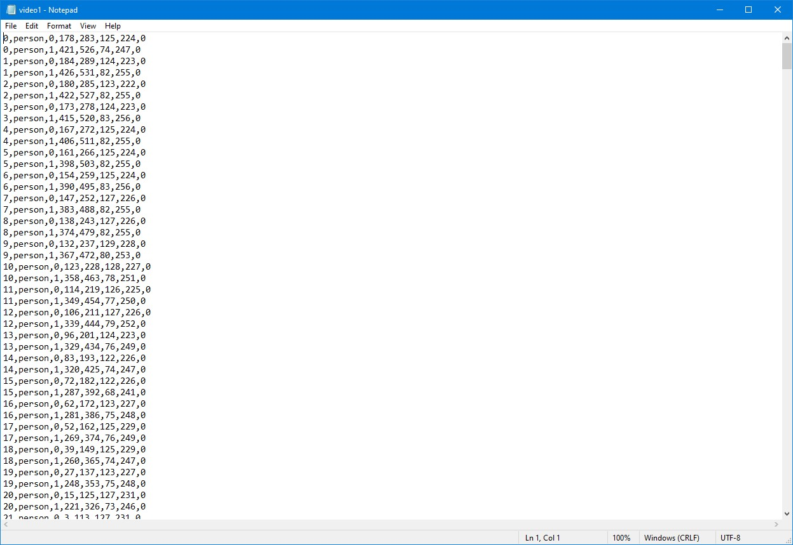

# Generate Annotations JSON Format for CreateML with Python

Python script which generates annotations in JSON format required for Calculating MOTP and MOTA given a hypothesis and GroundTruth.

 requires a list of dictionaries with information about the selected bounding boxes: center and size (height and width) of the bounding box.





## Code Description

The following codes Creates JSON filesfrom a given Boxes Coordinates.


## Run Script


1. Download DarkLabel [here](https://github.com/darkpgmr/DarkLabel) and Configure darklabel.yaml by adding the following User Format at end of file: 

```misc

format8:    # example of user-defined format (object tracking in videos)
  fixed_filetype: 0                 # if specified as true, save setting isn't changeable in GUI
  data_fmt: [fn, cname, id, x1, x2, y1, y2,difficult]
  gt_file_ext: "txt"                  # initial setting (the setting can be changed in GUI)
  gt_merged: 1                     # initial setting (the setting can be changed in GUI)
  classes_set: "my_classes1"      # if not specified, default setting is used 

```

2. Create GroundTruth boxes Using Darklabbel.
3. Generate Hypothesis boxes From Model.

`	$ Object_detection_video --input ./path_to_video --generatehypo true`

*In case Model skipped frames where there were no object and a value in every frame is needed use the following script to add values where empty

```bash
awk '{x=$1-b;while(x-->1){print ++b,",person,0,200,200,300,300,1""};b=$1}1' hypo.txt
```

4. Run DarkLabelTxtToNormalizedTxt.py to convert raw txt files to json friendly format.

`	$ DarkLabelTxtToNormalizedTxt -i ./pathToRawTxtFile -o ./pathToJosonFirendlyTxtFile` 

5. Run txtToJson.py to convert fiels created in step 4 to Json Files.

`	$ DarkLabelTxtToNormalizedTxt -i ./pathToJosonFirendlyTxtFile -o ./pathToJosonFile --typeoffile 'hypotheses or annotations' --fps FramesPerSecondofVideo`

6. Pass Files to pymot tool [here](https://github.com/Videmo/pymot) and examin results 


That's all! :D
